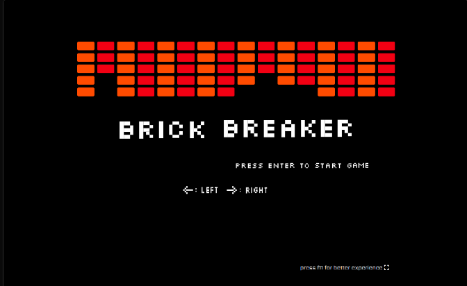

  

<h3 align="center">Brick Breaker</h3>

---

Brick Breaker is a classic arcade game where the player controls a paddle at the bottom of the screen to bounce a ball upwards, breaking bricks arranged in patterns at the top. The objective is to clear all the bricks by hitting them with the ball, using the paddle to prevent the ball from falling off the bottom of the screen.

## 📝 Table of Contents

- [📝 Table of Contents](#-table-of-contents)
- [🏁 Getting Started ](#-getting-started-)
  - [Prerequisites](#prerequisites)
- [🎈 Usage ](#-usage-)
- [🚀 Deployment ](#-deployment-)
- [⛏️ Built Using ](#️-built-using-)
- [✍️ Authors ](#️-authors-)
- [🎉 Acknowledgements ](#-acknowledgements-)

## 🏁 Getting Started 

You can clone the project and use live server to play locally or play [online](https://brick-breacker.vercel.app/). See [deployment](#deployment) for notes on how to deploy the project on a live system.

### Prerequisites

You need to install the "Go Live" extension.

## 🎈 Usage 

Play [here](https://brick-breacker.vercel.app/) .

## 🚀 Deployment 

The game is deployed on Vercel.

## ⛏️ Built Using 

- [JavaScript](https://www.javascript.com/) - Vanilla JavaScript
- [HTML](https://www.w3schools.com/html/) - Structure web page
- [CSS](https://www.w3schools.com/css/) - Style

## ✍️ Authors 

- [@mbadiao](https://github.com/mbadiao)

## 🎉 Acknowledgements 

- This project does not use Canvas or any framework.
- RequestAnimationFrame for animation.
